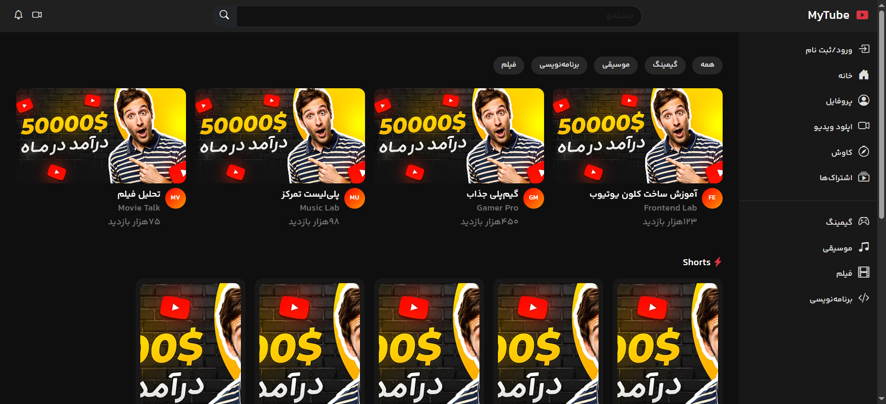
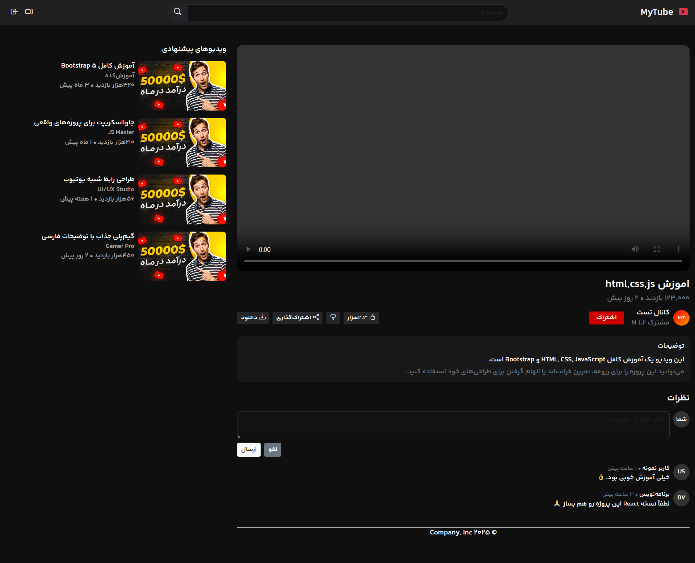
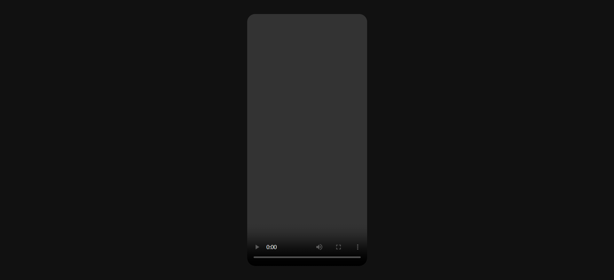
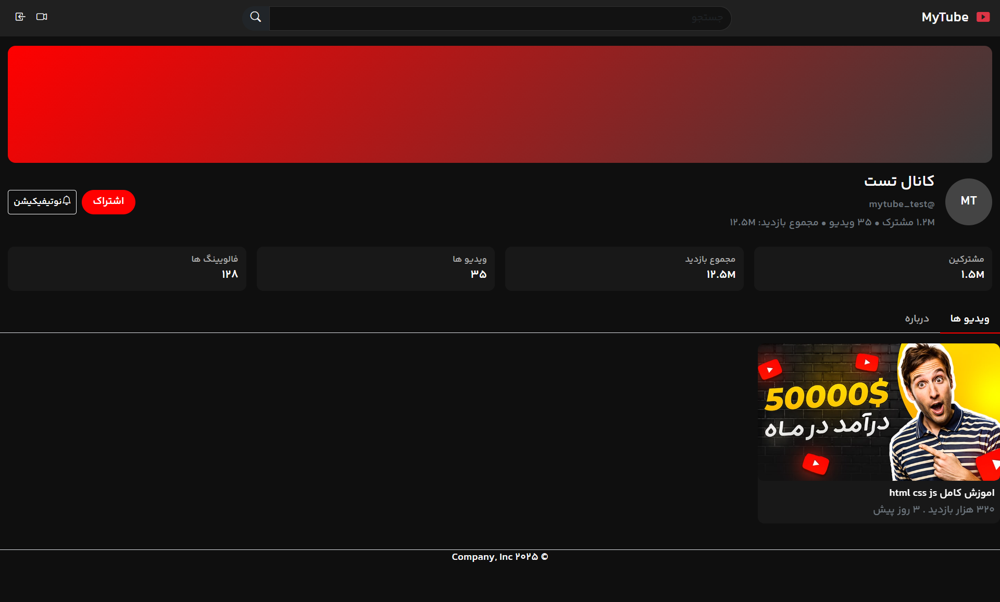
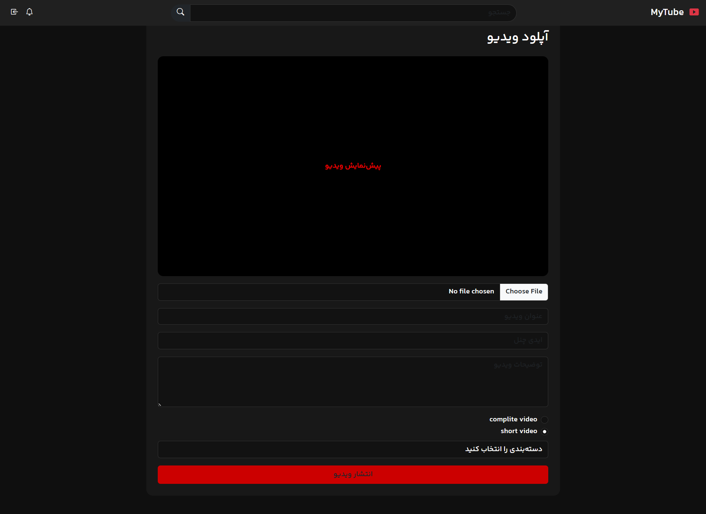

# YouTube Clone

A YouTube-inspired website built with HTML, CSS, and Bootstrap.

## Pages

- Home
- Watch
- Shorts
- Profile
- Upload

## Screenshots

### Home

### Watch

### Shorts

### Profile

### Upload

## Technologies

- HTML
- CSS
- Bootstrap

## How to View the Project

To view the project locally, open the `index.html` file in a modern web browser such as Google Chrome or Microsoft Edge.

The project also includes the following pages, which can be opened directly:

- `index.html` — Home Page
- `watch.html` — Watch Page
- `shorts.html` — Shorts Page
- `profile.html` — Profile Page

No additional installation or configuration is required to view the static website locally.
